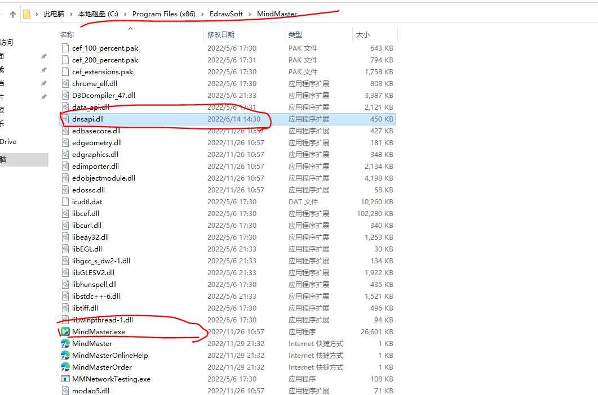
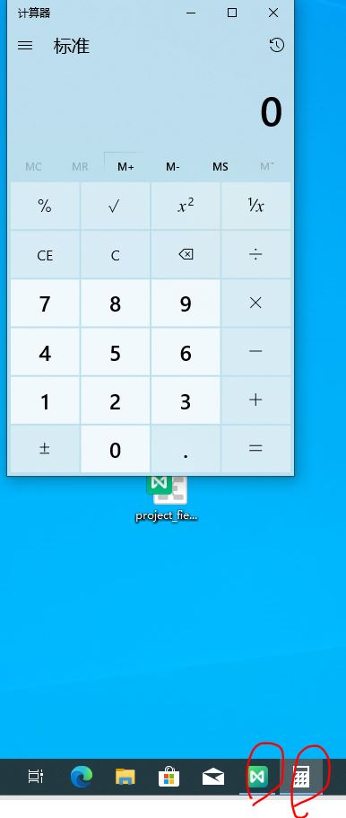

#  
 Vulnerability description

 There is a Dll hijack vul in MindMaster when open MindMaster 

#  
 Software version

Ver 10.0.8（2022.11.26update）

# 
 Software web

https://www.edrawsoft.cn/download/?type=1&tab=2

# 
 Software Download link

https://cc-download.edrawsoft.cn/origin/mindmaster_cn_full5375.exe?_gl=1*16kqd32*_ga*MTU0ODQ4MzQuMTY2NzU0MzI5MA..*_ga_24WTSJBD5B*MTY2OTcyNzIxMS4yLjEuMTY2OTcyNzI2Ni41LjAuMA..

# 
 Recurrennt enviorment

Win10

MindMaster Ver 10.0.8 

# 
 Recurrennt

<!-- 

 1.Open project file **.emmx with WinHex. File Head is Zip format.

  

  

--> 

 1.Copy a craft dll ( dnsapi.dll, dll main to run calc.exe )  to  MindMaster.exe   directory 

 C:\Program Files (x86)\EdrawSoft\MindMaster 

  

  

 2.Run MindMaster.exe 

  

 3.Calc.exe be runned by dnsapi.dll

  

  

 4.Recurrent Sucessed!

